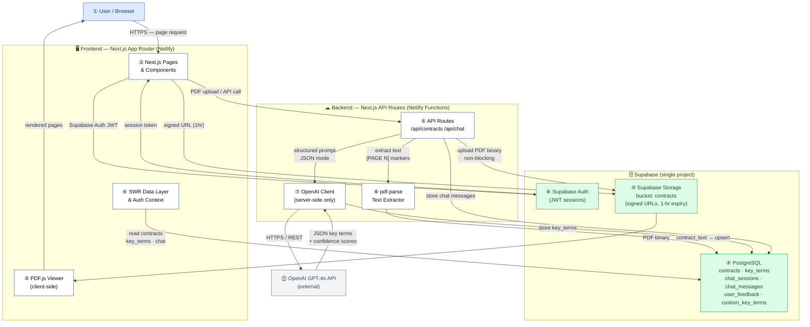
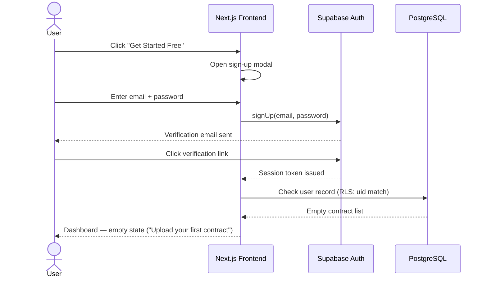
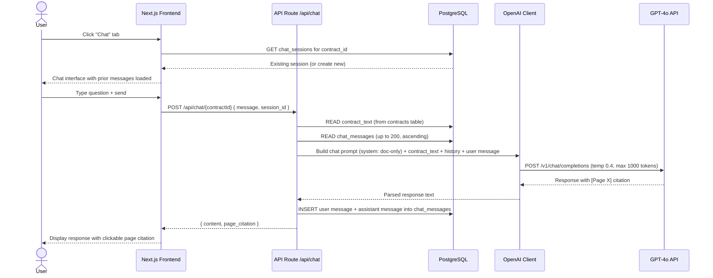
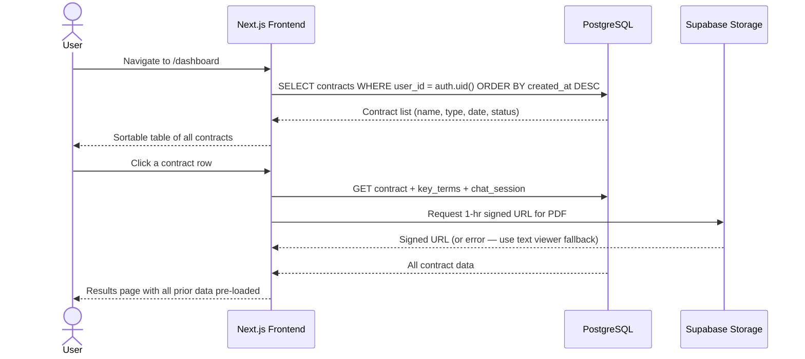

# ContractIQ — High-Level Design (HLD)

**Date:** 2026-10-05
**Version:** 1.0
**Status:** Approved for Implementation
**Author:** Engineering Team
**Source PRD:** `docs/ContractIQ_PRD.md` (v1.0, June 24 2026)

---

## Table of Contents

1. [Executive Summary](#1-executive-summary)
2. [Product Scope](#2-product-scope)
3. [User Personas](#3-user-personas)
4. [System Architecture Diagram](#4-system-architecture-diagram)
5. [User Flows](#5-user-flows)
6. [Frontend Architecture](#6-frontend-architecture)
7. [Backend Architecture](#7-backend-architecture)
8. [Database Design and Schema](#8-database-design-and-schema)
9. [AI Architecture](#9-ai-architecture)
10. [API Specification](#10-api-specification)
11. [Feature Breakdown](#11-feature-breakdown)
12. [Folder Structure](#12-folder-structure)
13. [Naming Conventions](#13-naming-conventions)
14. [Testing Strategy](#14-testing-strategy)
15. [Specs to Implementation Mapping](#15-specs-to-implementation-mapping)

---

## 1. Executive Summary

**Project:** ContractIQ

**Business Goal:** Eliminate the 90–120 minute NDA/MSA review burden for SMBs and freelancers who lack in-house legal counsel. ContractIQ uses GPT-4o to extract the 10–30 terms that actually matter from any uploaded contract, shows exactly where each term lives in the document, how confident the AI is in each extraction, and lets users ask follow-up questions in plain English — all in under 15 minutes.

**Problem Statement:** Business professionals routinely sign NDAs and MSAs without fully understanding what they are agreeing to. Manual review takes 90–120 minutes and requires legal expertise most SMBs don't have. Existing enterprise tools (DocuSign CLM, Ironclad, Kira) are priced for $50k–$500k annual contracts. Generic AI tools (ChatGPT) produce unstructured summaries with no page references, no confidence scores, and no contract-type-specific term libraries.

**Target Users:**
- Primary: Founders, COOs, Procurement Managers at 5–250 person companies (no in-house legal)
- Secondary: Freelancers and consultants signing client MSAs

**Success Criteria:**

| Metric | Target |
|--------|--------|
| North Star: time from upload to completed review | ≤ 15 minutes |
| Key term extraction accuracy (F1) | ≥ 88% on NDA test set; ≥ 85% on MSA |
| P95 upload-to-results latency | ≤ 30 seconds |
| 30-day user retention | ≥ 45% |
| AI extraction correction rate | ≤ 12% of terms |
| Cost per contract analysis | ≤ $0.25 (extraction ≤ $0.20) |
| NPS | ≥ 40 |

---

## 2. Product Scope

### In Scope — MVP (v0.1 through v1.0)

- Email/password authentication via Supabase Auth
- PDF upload: text-layer PDFs only, up to 10 MB / 20 pages
- Automated key term extraction for NDA and MSA contract types
- Confidence scoring (0–100%) per extracted term with colour-coded display
- Page number attribution and source sentence per term
- Custom key term addition (up to 5 terms) before processing
- Interactive PDF viewer (PDF.js) with click-to-navigate from key terms
- Paginated text viewer fallback when Supabase Storage is unavailable
- Key terms panel with inline editing and "Edited" badge
- Contract chat interface grounded strictly in the uploaded document
- Persistent chat history per contract session
- Dashboard with sortable contract history
- Low-confidence warnings (< 50%): ⚠️ icon and tooltip, never hidden
- "Not legal advice" disclaimer on every results page

### Out of Scope — MVP

- Scanned / image PDFs (no OCR)
- Non-English contracts
- Contracts in non-US / non-UK legal convention
- Batch upload (> 1 contract at a time)
- CSV or PDF export of key terms
- Multi-user workspaces / team plans
- Fine-tuned models
- Contract comparison view
- API access for third-party integrations
- Mobile-native app

### Future Enhancements (Post-v1.0)

| Version | Feature |
|---------|---------|
| v1.1 | CSV export, PDF report export, feedback submission UI, dashboard analytics charts |
| v1.2 | Scanned PDF support via OCR (AWS Textract), contract comparison view, batch upload (up to 5), multi-user workspaces, email notifications |
| v2.0 | Fine-tuned extraction model, API access tier, contract templates, jurisdiction detection |

---

## 3. User Personas

### Persona 1 — The Time-Pressed Founder / Ops Lead

| Attribute | Detail |
|-----------|--------|
| **Role** | Founder, COO, Procurement Manager, Legal Operations Manager |
| **Industry** | SaaS, agency, professional services, fintech, e-commerce |
| **Company size** | 5–250 employees; no in-house legal counsel |
| **Contract volume** | 5–15 NDAs or MSAs per month |
| **Current behaviour** | Google searches, expensive ad-hoc legal consultations ($250–$500/hr), misses auto-renewal and indemnification clauses |
| **Pain** | 90–120 minutes per review; pays for lawyer on routine contracts |
| **Permissions** | Full access — upload, review, chat, edit terms, view dashboard |
| **Primary workflow** | Upload → Process → Review key terms → Chat questions → Sign or negotiate |

### Persona 2 — The Freelancer / Consultant

| Attribute | Detail |
|-----------|--------|
| **Role** | Designer, developer, marketing consultant, independent contractor |
| **Industry** | Creative, software, consulting |
| **Contract volume** | 1–4 MSAs per month from larger clients |
| **Current behaviour** | Signs without reading carefully due to power imbalance with clients |
| **Pain** | Cannot afford legal review; unsure which clauses are non-standard or risky |
| **Permissions** | Full access — same as Persona 1 |
| **Primary workflow** | Upload client MSA → Review flagged clauses → Ask chat "is this standard?" → Decide to sign or push back |

---

## 4. System Architecture Diagram



### Flow Legend

| Step | Component | Responsibility |
|------|-----------|----------------|
| ① | User / Browser | Initiates all actions via HTTPS; runs PDF.js rendering client-side |
| ② | Next.js Pages & Components | Renders all UI — upload, results, dashboard, chat; routes via App Router |
| ③ | PDF.js Viewer | Renders PDF pages inline from Supabase Storage signed URL; handles page navigation and zoom |
| ④ | SWR Data Layer & Auth Context | Fetches and caches contract data, key terms, and chat messages; holds Supabase auth session |
| ⑤ | API Routes `/api/contracts` `/api/chat` | Orchestrates upload → extract → process pipeline; handles chat message routing |
| ⑥ | pdf-parse Text Extractor | Extracts text from uploaded PDF binary once at upload time; inserts `[PAGE N]` markers; stored in `contracts.contract_text` |
| ⑦ | OpenAI Client (server-side) | Builds and sends structured prompts to GPT-4o; parses JSON responses; never exposed to client |
| ⑧ | Supabase Auth | Issues and validates JWT tokens; manages email/password sessions |
| ⑨ | PostgreSQL | Single source of truth for all structured data — contracts, terms, chat, feedback |
| ⑩ | Supabase Storage | Stores original PDF files; provides 1-hour signed URLs for PDF.js viewer; non-blocking (viewer falls back to text if unavailable) |
| ⑪ | OpenAI GPT-4o API | Performs key term extraction (JSON mode, temp 0.1) and contract chat (temp 0.4) |

---

## 5. User Flows

### Flow 1 — New Visitor → Sign Up → Dashboard

```
Click "Get Started Free" → Supabase Auth modal → Email verification → Redirect to Dashboard
```



**Acceptance criteria:** Auth completes in ≤ 10 seconds; redirect to Dashboard on success; invalid credentials return a clear error.

---

### Flow 2 — Core Review Flow: Upload → Process → Results

```
Select contract type → Upload PDF → Text extraction → Preview standard terms
→ Add custom terms (optional) → Click "Process Contract" → OpenAI extraction
→ Results page (PDF viewer + key terms panel)
```

```mermaid
sequenceDiagram
    actor U as User
    participant FE as Next.js Frontend
    participant API as API Route /api/contracts
    participant PP as pdf-parse
    participant ST as Supabase Storage
    participant DB as PostgreSQL
    participant OC as OpenAI Client
    participant GPT as GPT-4o API

    U->>FE: Select contract type (NDA/MSA) + upload PDF
    FE->>API: POST /api/contracts/upload (multipart)
    API->>API: Validate file (≤10MB, ≤20 pages, text-layer)
    API->>PP: Extract text with [PAGE N] markers
    PP-->>API: contract_text string
    API->>DB: INSERT contracts row (status: "uploaded", contract_text stored)
    API->>ST: Upload PDF binary (non-blocking, async)
    API-->>FE: { contract_id, status: "uploaded" }
    FE-->>U: Show pre-processing preview (standard terms list)
    U->>FE: Optionally add custom terms
    FE->>DB: INSERT custom_key_terms rows
    U->>FE: Click "Process Contract"
    FE->>API: POST /api/contracts/{id}/process
    API->>DB: READ contract_text + custom_key_terms
    API->>OC: Build few-shot extraction prompt
    OC->>GPT: POST /v1/chat/completions (JSON mode, temp 0.1)
    GPT-->>OC: JSON array of key terms
    OC->>OC: Parse + validate JSON; retry once if malformed
    OC-->>API: Parsed key terms array
    API->>DB: INSERT key_terms rows (all terms + confidence + source_sentence)
    API->>DB: UPDATE contracts status = "processed"
    API-->>FE: { key_terms, status: "processed" }
    FE-->>U: Results page — PDF viewer (left) + key terms panel (right)
```

**Acceptance criteria:** Upload → results in ≤ 30s P95 for ≤ 20 pages; key terms panel shows all standard terms with value, page, confidence; terms < 50% confidence show ⚠️.

---

### Flow 3 — Chat with Contract

```
Results page → Click "Chat" tab → Type question → GPT-4o response (grounded) → Saved to DB
```



**Acceptance criteria:** Chat response in ≤ 15s P95; every response includes [Page X] citation; "I cannot find this in the document" when answer is absent.

---

### Flow 4 — Dashboard → Open Previous Contract

```
Dashboard → Sortable contract list → Click row → Results page (pre-loaded)
```



---

## 6. Frontend Architecture

### Stack

| Layer | Technology | Purpose |
|-------|-----------|---------|
| Framework | Next.js 14 (App Router) | File-based routing, Server Components, API Routes |
| Language | TypeScript (strict mode) | Type safety across components and API contracts |
| Styling | Tailwind CSS | Utility-first; configured with allNeurons design tokens |
| Data fetching | SWR | Client-side data fetching with revalidation and caching |
| Auth client | `@supabase/ssr` | Server and client Supabase Auth helpers for Next.js |
| PDF rendering | PDF.js (`pdfjs-dist`) | Client-side PDF viewer with page navigation |
| HTTP client | `fetch` (native) | API calls from Server Actions and client components |

### Design System Tokens

Applied from `docs/design.md` (allNeurons Design System v1.3.0):

| Token | Value | Usage |
|-------|-------|-------|
| `bg-page` | `#FAFAFA` | Page background |
| `bg-surface` | `#FFFFFF` | Cards, panels, modals |
| `ink-900` | `#080A0E` | Headings, primary text |
| `ink-600` | `#4A4C4F` | Secondary labels |
| `primary blue-600` | `#125ACB` | Primary buttons, active states |
| `green-50 / green-700` | confidence ≥ 80% | High-confidence term badge |
| `orange-500` | confidence 50–79% | Amber confidence badge |
| `red-500 / red-700` | confidence < 50% | Low-confidence warning |

### Routing Structure

```
app/
├── page.tsx                          # Landing page (public)
├── layout.tsx                        # Root layout (font, global styles)
├── (auth)/
│   ├── signin/page.tsx               # Sign-in form
│   └── signup/page.tsx               # Sign-up form
└── (app)/                            # Protected routes (auth middleware)
    ├── layout.tsx                    # App shell: sidebar/nav
    ├── dashboard/page.tsx            # Contract history dashboard
    ├── upload/page.tsx               # Upload + pre-processing preview
    └── contracts/[id]/page.tsx       # Results: PDF viewer + key terms + chat
```

### UX States

Every data-driven component implements four states:

| State | Implementation |
|-------|---------------|
| **Loading** | Skeleton components (`animate-pulse`); step progress indicator during processing |
| **Empty** | Illustrated empty state with primary CTA ("Upload your first contract") |
| **Error** | Toast notification + inline error message with retry option |
| **Responsive** | Tailwind responsive prefixes; results page stacks to single column below `md:` breakpoint |

### Component Hierarchy

```
app/(app)/contracts/[id]/page.tsx
├── ResultsHeader (contract name, type, date, "Not legal advice" disclaimer)
├── ResultsLayout (two-panel grid)
│   ├── PdfViewerPanel
│   │   ├── PdfViewer (PDF.js — primary)
│   │   └── TextViewer (fallback when Storage unavailable)
│   └── KeyTermsPanel
│       ├── TermCard[] (term name, value, page link, confidence badge)
│       │   ├── ConfidenceBadge (green/amber/red)
│       │   ├── SourceSentenceTooltip ("Why?" expandable)
│       │   ├── LowConfidenceWarning (⚠️ + tooltip, shown if < 50%)
│       │   └── TermEditor (inline edit, saves to API, shows "Edited" badge)
│       └── AddCustomTermButton
└── ChatSidebar
    ├── ChatMessageList (user messages right, assistant left)
    └── ChatInput (textarea + send button)
```

```
app/(app)/upload/page.tsx
├── ContractTypeSelector (NDA / MSA dropdown)
├── FileDropzone (drag-drop + file-picker, 10MB limit enforced client-side)
├── TermPreviewCard (standard terms list for selected type)
├── CustomTermInput (+ Add Key Term, max 5, "Custom" badge)
└── ProcessButton (triggers /api/contracts/[id]/process)
```

```
app/(app)/dashboard/page.tsx
├── DashboardStats (total contracts, NDA count, MSA count)
└── ContractTable
    ├── SortableHeader (name, type, date, status)
    └── ContractRow[] → links to /contracts/[id]
```

### State Management

| State | Mechanism | Scope |
|-------|-----------|-------|
| Auth session | `AuthContext` (React Context) + Supabase `onAuthStateChange` | Global |
| Contract data + key terms | SWR (`useContract` hook) | Contract page |
| Chat messages | SWR with optimistic update (`useChatMessages`) | Chat sidebar |
| PDF viewer page target | Local `useState` (`targetPage`) in `ResultsLayout` | Results page |
| Upload progress | Local `useState` | Upload page |
| Term edit state | Local `useState` per `TermCard` | Key terms panel |

---

## 7. Backend Architecture

### Stack

| Layer | Technology | Notes |
|-------|-----------|-------|
| API framework | Next.js App Router API Routes | Deployed as Netlify Functions |
| PDF extraction | `pdf-parse` (Node.js) | Server-side only; no data egress |
| OpenAI | `openai` npm SDK | API key server-side only (never in client bundle) |
| Supabase client | `@supabase/supabase-js` (service role) | Server-side writes bypass RLS; reads use user JWT |
| Validation | `zod` | Request body and OpenAI response validation |
| Auth middleware | `@supabase/ssr` `createServerClient` | Validates JWT on every protected route |

### Middleware

All API routes under `/api/` (except public routes) run through `lib/middleware/auth.ts`:

```
Request → Extract Bearer token from Authorization header
→ supabase.auth.getUser(token)
→ If invalid: return 401 { error: "Unauthorized" }
→ If valid: attach user to request context → proceed to handler
```

### Error Handling

| Scenario | Behaviour |
|----------|-----------|
| PDF > 10 MB | Reject at upload with 400 `{ error: "File exceeds 10 MB limit" }` |
| PDF > 20 pages | Reject at upload with 400 `{ error: "Contract exceeds 20-page limit" }` |
| Extracted text < 100 words | 422 `{ error: "Scanned PDFs are not supported yet" }` |
| Contract > 15,000 tokens | 422 `{ error: "Contract is too long for MVP — max 15,000 tokens" }` |
| OpenAI response non-JSON | Retry once with correction prompt; if still fails: 502 `{ error: "AI extraction failed — please try again" }` |
| OpenAI API timeout/error | 3 retries with exponential backoff (1s, 2s, 4s); after 3 failures: 503 `{ error: "AI service temporarily unavailable" }` |
| Supabase Storage upload failure | Log error, set `file_path = null`, continue — AI pipeline uses `contract_text` from DB |
| DB write failure | 500 `{ error: "Database error — your contract was not saved" }` |

### Core Service Modules

| Module | Path | Responsibility |
|--------|------|---------------|
| PDF extractor | `lib/pdf/extractor.ts` | Wraps `pdf-parse`; adds `[PAGE N]` markers; returns text + page count + word count |
| OpenAI extraction | `lib/openai/extract.ts` | Builds few-shot extraction prompt; calls GPT-4o; parses and validates JSON response; handles retry |
| OpenAI chat | `lib/openai/chat.ts` | Builds grounded chat prompt; passes full contract text + conversation history; enforces page citation |
| Supabase client | `lib/supabase/server.ts` | Server-side Supabase client factory (service role + user JWT variants) |
| Auth helpers | `lib/middleware/auth.ts` | JWT validation wrapper for API routes |
| Prompt builder | `lib/openai/prompts.ts` | Versioned prompt templates for NDA and MSA extraction + chat system prompt |

---

## 8. Database Design and Schema

### Overview

Single Supabase PostgreSQL project. All tables use `user_id UUID REFERENCES auth.users(id)` as the RLS anchor. Row Level Security is enabled on every table.

---

### Table: `contracts`

**Purpose:** Core record for each uploaded contract. Stores extracted text (so AI pipeline never re-reads the PDF).

| Column | Type | Constraints | Notes |
|--------|------|-------------|-------|
| `id` | `UUID` | PK, DEFAULT `gen_random_uuid()` | |
| `user_id` | `UUID` | NOT NULL, FK → `auth.users(id)` | RLS anchor |
| `name` | `TEXT` | NOT NULL | Original filename |
| `contract_type` | `TEXT` | NOT NULL, CHECK IN ('NDA','MSA') | |
| `contract_text` | `TEXT` | NOT NULL | Full text with `[PAGE N]` markers |
| `file_path` | `TEXT` | NULLABLE | Supabase Storage path; null if upload failed |
| `status` | `TEXT` | NOT NULL, DEFAULT 'uploaded' | `uploaded` → `processing` → `processed` → `error` |
| `page_count` | `INTEGER` | NOT NULL | |
| `token_count` | `INTEGER` | NULLABLE | Estimated token count for cost tracking |
| `created_at` | `TIMESTAMPTZ` | NOT NULL, DEFAULT `now()` | |
| `updated_at` | `TIMESTAMPTZ` | NOT NULL, DEFAULT `now()` | |

**Indexes:** `CREATE INDEX ON contracts(user_id);` `CREATE INDEX ON contracts(user_id, created_at DESC);`

**RLS policies:**
```sql
CREATE POLICY "users read own contracts" ON contracts FOR SELECT USING (auth.uid() = user_id);
CREATE POLICY "users insert own contracts" ON contracts FOR INSERT WITH CHECK (auth.uid() = user_id);
CREATE POLICY "users update own contracts" ON contracts FOR UPDATE USING (auth.uid() = user_id);
CREATE POLICY "users delete own contracts" ON contracts FOR DELETE USING (auth.uid() = user_id);
```

---

### Table: `key_terms`

**Purpose:** Stores every extracted term (standard and custom) with confidence, page, and source sentence.

| Column | Type | Constraints | Notes |
|--------|------|-------------|-------|
| `id` | `UUID` | PK, DEFAULT `gen_random_uuid()` | |
| `contract_id` | `UUID` | NOT NULL, FK → `contracts(id) ON DELETE CASCADE` | |
| `user_id` | `UUID` | NOT NULL, FK → `auth.users(id)` | RLS anchor (denormalised for query speed) |
| `term_name` | `TEXT` | NOT NULL | e.g. `"Governing Law"` |
| `value` | `TEXT` | NOT NULL | Current value (may be user-edited) |
| `original_value` | `TEXT` | NULLABLE | AI-extracted value before any user edit |
| `page_number` | `INTEGER` | NOT NULL | 1-indexed page where the term was found |
| `confidence_score` | `NUMERIC(5,2)` | NOT NULL, CHECK 0 ≤ x ≤ 100 | Percentage (e.g. `87.50`) |
| `source_sentence` | `TEXT` | NOT NULL | Verbatim sentence from contract used for extraction |
| `is_custom` | `BOOLEAN` | NOT NULL, DEFAULT false | True for user-added custom terms |
| `is_edited` | `BOOLEAN` | NOT NULL, DEFAULT false | True after user edits value inline |
| `created_at` | `TIMESTAMPTZ` | NOT NULL, DEFAULT `now()` | |

**Indexes:** `CREATE INDEX ON key_terms(contract_id);` `CREATE INDEX ON key_terms(user_id, contract_id);`

**RLS policies:**
```sql
CREATE POLICY "users read own key_terms" ON key_terms FOR SELECT USING (auth.uid() = user_id);
CREATE POLICY "users insert own key_terms" ON key_terms FOR INSERT WITH CHECK (auth.uid() = user_id);
CREATE POLICY "users update own key_terms" ON key_terms FOR UPDATE USING (auth.uid() = user_id);
```

---

### Table: `custom_key_terms`

**Purpose:** Captures user-specified term names before processing. These are injected into the extraction prompt.

| Column | Type | Constraints | Notes |
|--------|------|-------------|-------|
| `id` | `UUID` | PK, DEFAULT `gen_random_uuid()` | |
| `contract_id` | `UUID` | NOT NULL, FK → `contracts(id) ON DELETE CASCADE` | |
| `user_id` | `UUID` | NOT NULL, FK → `auth.users(id)` | |
| `term_name` | `TEXT` | NOT NULL | User-entered term name (e.g. `"Non-compete radius"`) |
| `created_at` | `TIMESTAMPTZ` | NOT NULL, DEFAULT `now()` | |

**Constraint:** Maximum 5 rows per `contract_id` enforced at application level (API validates before insert).

**RLS policies:**
```sql
CREATE POLICY "users read own custom_key_terms" ON custom_key_terms FOR SELECT USING (auth.uid() = user_id);
CREATE POLICY "users insert own custom_key_terms" ON custom_key_terms FOR INSERT WITH CHECK (auth.uid() = user_id);
CREATE POLICY "users delete own custom_key_terms" ON custom_key_terms FOR DELETE USING (auth.uid() = user_id);
```

---

### Table: `chat_sessions`

**Purpose:** One session per contract per user. Anchor for all chat messages.

| Column | Type | Constraints | Notes |
|--------|------|-------------|-------|
| `id` | `UUID` | PK, DEFAULT `gen_random_uuid()` | |
| `contract_id` | `UUID` | NOT NULL, FK → `contracts(id) ON DELETE CASCADE`, UNIQUE | One session per contract |
| `user_id` | `UUID` | NOT NULL, FK → `auth.users(id)` | |
| `created_at` | `TIMESTAMPTZ` | NOT NULL, DEFAULT `now()` | |

**RLS policies:**
```sql
CREATE POLICY "users read own chat_sessions" ON chat_sessions FOR SELECT USING (auth.uid() = user_id);
CREATE POLICY "users insert own chat_sessions" ON chat_sessions FOR INSERT WITH CHECK (auth.uid() = user_id);
```

---

### Table: `chat_messages`

**Purpose:** Individual messages within a chat session, stored for persistence and context window reconstruction.

| Column | Type | Constraints | Notes |
|--------|------|-------------|-------|
| `id` | `UUID` | PK, DEFAULT `gen_random_uuid()` | |
| `session_id` | `UUID` | NOT NULL, FK → `chat_sessions(id) ON DELETE CASCADE` | |
| `user_id` | `UUID` | NOT NULL, FK → `auth.users(id)` | RLS anchor |
| `role` | `TEXT` | NOT NULL, CHECK IN ('user','assistant') | |
| `content` | `TEXT` | NOT NULL | Message text |
| `page_citation` | `INTEGER` | NULLABLE | Page number extracted from `[Page X]` in assistant response |
| `created_at` | `TIMESTAMPTZ` | NOT NULL, DEFAULT `now()` | |

**Indexes:** `CREATE INDEX ON chat_messages(session_id, created_at ASC);`

**RLS policies:**
```sql
CREATE POLICY "users read own chat_messages" ON chat_messages FOR SELECT USING (auth.uid() = user_id);
CREATE POLICY "users insert own chat_messages" ON chat_messages FOR INSERT WITH CHECK (auth.uid() = user_id);
```

---

### Table: `user_feedback`

**Purpose:** Captures per-contract thumbs up/down rating and optional text comment.

| Column | Type | Constraints | Notes |
|--------|------|-------------|-------|
| `id` | `UUID` | PK, DEFAULT `gen_random_uuid()` | |
| `contract_id` | `UUID` | NOT NULL, FK → `contracts(id) ON DELETE CASCADE` | |
| `user_id` | `UUID` | NOT NULL, FK → `auth.users(id)` | |
| `rating` | `TEXT` | NOT NULL, CHECK IN ('up','down') | |
| `comment` | `TEXT` | NULLABLE | Optional free-text comment |
| `created_at` | `TIMESTAMPTZ` | NOT NULL, DEFAULT `now()` | |

**RLS policies:**
```sql
CREATE POLICY "users read own feedback" ON user_feedback FOR SELECT USING (auth.uid() = user_id);
CREATE POLICY "users insert own feedback" ON user_feedback FOR INSERT WITH CHECK (auth.uid() = user_id);
```

---

### Supabase Storage

**Bucket:** `contracts` (private — not publicly accessible)

**File path pattern:** `contracts/{user_id}/{contract_id}/{filename}.pdf`

**Setup SQL (must be in database.sql — not dashboard):**
```sql
INSERT INTO storage.buckets (id, name, public)
VALUES ('contracts', 'contracts', false)
ON CONFLICT (id) DO NOTHING;

CREATE POLICY "users upload own contracts" ON storage.objects
  FOR INSERT WITH CHECK (
    bucket_id = 'contracts' AND
    auth.uid()::text = (storage.foldername(name))[1]
  );

CREATE POLICY "users read own contracts" ON storage.objects
  FOR SELECT USING (
    bucket_id = 'contracts' AND
    auth.uid()::text = (storage.foldername(name))[1]
  );

CREATE POLICY "users delete own contracts" ON storage.objects
  FOR DELETE USING (
    bucket_id = 'contracts' AND
    auth.uid()::text = (storage.foldername(name))[1]
  );
```

**Signed URLs:** Generated server-side with 1-hour expiry. Client never holds a permanent URL.

---

## 9. AI Architecture

### Provider & Model

| Parameter | Value | Rationale |
|-----------|-------|-----------|
| Provider | OpenAI API | Best-in-class JSON mode and legal text reasoning |
| Model | `gpt-4o` | 128k context window; handles 20-page contracts (≈15k tokens) |
| Response format | `{ type: "json_object" }` | Eliminates unparseable free-text responses |
| API key | Server-side only (`OPENAI_API_KEY` env var) | Never exposed to client bundle |

### Key Term Extraction

| Parameter | Value |
|-----------|-------|
| Temperature | 0.1 (deterministic structured output) |
| Max output tokens | 2,000 |
| Technique | Few-shot: 3 labelled NDA examples + 3 labelled MSA examples in system prompt |
| Output schema | `Array<{ term_name: string, value: string, page_number: number, confidence_score: number, source_sentence: string }>` |

**Prompt strategy:**
```
System:
  You are a contract analysis AI. Extract the key terms listed below from the provided contract text.
  Return ONLY a valid JSON array with no explanation.
  For each term: term_name, value, page_number (1-indexed), confidence_score (0–100), source_sentence (verbatim sentence).
  If a term is not found, include it with value: "Not found", confidence_score: 0, source_sentence: "".
  [3 NDA few-shot examples]
  [3 MSA few-shot examples]

User:
  Contract type: {NDA|MSA}
  Terms to extract: {standard_terms} + {custom_terms}
  Contract text:
  {contract_text with [PAGE N] markers}
```

**Retry logic:** If JSON parse fails → send correction prompt: `"Your previous response was not valid JSON. Return only the JSON array, no explanation."` → one retry → if still fails, surface 502 error to user.

### Contract Chat

| Parameter | Value |
|-----------|-------|
| Temperature | 0.4 (natural conversational responses) |
| Max output tokens | 1,000 |
| Context strategy | Full contract text on every turn (contracts ≤ 15,000 tokens) |
| History | All messages for the session (up to 200), ascending order |
| Query classification | `contract` / `history` / `both` — adjusts system prompt without extra API call |

**System prompt:**
```
You are a contract review assistant. Answer questions ONLY based on the document text provided below.
If the answer is not in the document, say exactly: "I cannot find this in the document."
Every response MUST include a [Page X] citation where X is the page number.
Begin every answer with "Based on the document, ..."
Do not use general legal knowledge. Do not provide legal advice.
```

### Token Budget & Cost Controls

| Item | Estimate | Cost (GPT-4o pricing) |
|------|----------|----------------------|
| 20-page contract input tokens | ~15,000 | $0.075 (@ $0.005/1k) |
| Extraction output tokens | ~1,500 | $0.0225 (@ $0.015/1k) |
| **Extraction total** | | **~$0.097 per contract** |
| Chat turn input (contract + history) | ~16,000 | $0.08 per turn |
| Chat turn output | ~500 | $0.0075 per turn |

**Cost guardrails:**
- Reject contracts > 15,000 tokens at upload (before any OpenAI call)
- Maximum 5 custom terms to cap prompt length
- Alert at 80% of $0.25/contract budget threshold in monitoring
- Monthly cost review; evaluate Claude Haiku or GPT-4o-mini as fallback if costs double

### Confidence Score Calibration

- Self-reported by model in extraction prompt (0–100 scale)
- Monthly calibration evaluation: predicted confidence vs. actual accuracy bucketed by 10% intervals
- If calibration error > 15%: show UI warning banner on results page

### Hallucination Guardrails

| Layer | Control |
|-------|---------|
| Extraction | Temperature 0.1 + JSON mode + source_sentence requirement |
| Chat | System prompt forbids general knowledge; mandatory [Page X] citation |
| UI | ⚠️ warning on confidence < 50%; non-dismissible tooltip |
| Automated test | Feed question about topic not in document → assert "I cannot find this" |

---

## 10. API Specification

All API routes require `Authorization: Bearer {supabase_jwt}` header except where noted. All responses are `Content-Type: application/json`. All error responses follow `{ "error": "Human-readable message" }`.

---

### POST `/api/contracts/upload`

**Purpose:** Accept PDF upload, extract text via pdf-parse, create contract record in DB, upload PDF to Storage (non-blocking).

**Auth:** Required

**Request:** `multipart/form-data`

| Field | Type | Required | Constraints |
|-------|------|----------|-------------|
| `file` | File (PDF) | Yes | ≤ 10 MB, ≤ 20 pages |
| `contract_type` | String | Yes | `"NDA"` or `"MSA"` |
| `name` | String | No | Defaults to filename |

**Response 201:**
```json
{
  "contract_id": "uuid",
  "status": "uploaded",
  "page_count": 12,
  "token_count": 8400,
  "standard_terms": ["Parties", "Effective Date", "..."]
}
```

**Error responses:**

| Code | Condition |
|------|-----------|
| 400 | File missing, wrong MIME type, > 10 MB, > 20 pages |
| 401 | Invalid or missing JWT |
| 422 | Extracted text < 100 words (scanned PDF) |
| 422 | Estimated tokens > 15,000 |
| 500 | DB write failure |

---

### POST `/api/contracts/[id]/process`

**Purpose:** Trigger OpenAI key term extraction for a previously uploaded contract.

**Auth:** Required. User must own the contract.

**Request:** `application/json`

```json
{
  "custom_term_ids": ["uuid", "uuid"]
}
```

**Response 200:**
```json
{
  "contract_id": "uuid",
  "status": "processed",
  "key_terms": [
    {
      "id": "uuid",
      "term_name": "Governing Law",
      "value": "State of Delaware",
      "page_number": 8,
      "confidence_score": 94.5,
      "source_sentence": "This Agreement shall be governed by the laws of the State of Delaware.",
      "is_custom": false,
      "is_edited": false
    }
  ]
}
```

**Error responses:**

| Code | Condition |
|------|-----------|
| 400 | Contract not in "uploaded" status |
| 401 | Invalid or missing JWT |
| 403 | User does not own contract |
| 404 | Contract not found |
| 502 | OpenAI extraction failed after retry |
| 503 | OpenAI API unavailable after 3 retries |

---

### GET `/api/contracts/[id]`

**Purpose:** Fetch contract metadata + all key terms for the results page.

**Auth:** Required. User must own the contract.

**Response 200:**
```json
{
  "contract": {
    "id": "uuid",
    "name": "Acme_NDA_2026.pdf",
    "contract_type": "NDA",
    "status": "processed",
    "page_count": 12,
    "created_at": "2026-10-05T09:00:00Z",
    "signed_url": "https://...supabase.co/storage/v1/object/sign/...?token=..."
  },
  "key_terms": [ /* same shape as /process response */ ],
  "chat_session_id": "uuid"
}
```

**Error responses:** 401, 403, 404

---

### PATCH `/api/key-terms/[id]`

**Purpose:** Save a user's inline edit to a key term value.

**Auth:** Required. User must own the key term.

**Request:** `application/json`

```json
{
  "value": "Updated term value"
}
```

**Response 200:**
```json
{
  "id": "uuid",
  "value": "Updated term value",
  "original_value": "Original AI value",
  "is_edited": true
}
```

**Error responses:** 400 (empty value), 401, 403, 404. Must complete in ≤ 2 seconds.

---

### POST `/api/chat/[contractId]`

**Purpose:** Accept a user chat message, build grounded prompt, call GPT-4o, persist both messages, return response.

**Auth:** Required. User must own the contract.

**Request:** `application/json`

```json
{
  "message": "What happens if I breach the NDA?",
  "session_id": "uuid"
}
```

**Response 200:**
```json
{
  "content": "Based on the document, if you breach the NDA... [Page 7]",
  "page_citation": 7,
  "session_id": "uuid",
  "message_id": "uuid"
}
```

**Error responses:** 400 (empty message), 401, 403, 404, 503 (OpenAI unavailable). Must respond in ≤ 15 seconds P95.

---

### GET `/api/chat/[contractId]`

**Purpose:** Fetch full chat history for a contract (used on page load to restore prior conversation).

**Auth:** Required. User must own the contract.

**Response 200:**
```json
{
  "session_id": "uuid",
  "messages": [
    {
      "id": "uuid",
      "role": "user",
      "content": "What happens if I breach the NDA?",
      "page_citation": null,
      "created_at": "2026-10-05T09:05:00Z"
    },
    {
      "id": "uuid",
      "role": "assistant",
      "content": "Based on the document, if you breach the NDA... [Page 7]",
      "page_citation": 7,
      "created_at": "2026-10-05T09:05:08Z"
    }
  ]
}
```

**Error responses:** 401, 403, 404

---

## 11. Feature Breakdown

### Phase 1 — MVP (Weeks 1–14, v0.1 through v1.0)

| Feature | Acceptance Criteria | Dependencies |
|---------|---------------------|--------------|
| **US-001 Auth (sign up / sign in / sign out)** | Auth flow ≤ 10s; redirect to Dashboard on success; invalid credentials show error | Supabase project provisioned |
| **US-002 PDF upload + text extraction** | Accepts PDFs ≤ 10 MB / 20 pages; extraction ≤ 30s P95; text stored in `contracts.contract_text` | `pdf-parse` installed |
| **US-003 Page number attribution** | Each term shows 1-indexed page number; clicking scrolls PDF viewer | US-002 complete |
| **US-004 Confidence score display** | Each term shows 0–100% score; < 50% shows ⚠️ with tooltip | US-002 complete |
| **US-005 Custom key terms** | Up to 5 custom terms added pre-processing; appear in results with same schema | US-002 complete |
| **US-006 Inline PDF viewer** | PDF.js renders all pages; zoom / scroll; highlights on term click; text viewer fallback | US-002, Supabase Storage bucket created |
| **US-007 Chat with contract** | Response ≤ 15s; grounded in document; every response cites [Page X] | US-002, chat_sessions + chat_messages tables |
| **US-008 Dashboard with contract history** | Shows name, type, date, status; sortable; rows link to results | Auth + contracts table |
| **US-009 Inline key term editing** | Edit saves to Supabase ≤ 2s; "Edited" badge shown; original AI value preserved | US-002 complete |
| **US-010 Feedback submission** | Thumbs up/down + optional comment; saved to `user_feedback` | Results page |
| **US-012 Persistent chat history** | Reopening results page loads prior chat messages | US-007 complete |

### Phase 2 — Post-Launch Iteration (Weeks 15–18, v1.1)

| Feature | Acceptance Criteria | Dependencies |
|---------|---------------------|--------------|
| **US-011 Export key terms to CSV** | Export button downloads CSV within 5s | Results page + key_terms data |
| **Export results to PDF** | Formatted summary PDF downloaded within 5s | Results page |
| **Dashboard analytics charts** | Charts: contracts by month, term correction rate | Dashboard + sufficient data |
| **Feedback UI polish** | Post-review survey prompt; NPS collection | US-010 base |

### Phase 3 — Growth (Weeks 19–24, v1.2)

| Feature | Acceptance Criteria | Dependencies |
|---------|---------------------|--------------|
| **Scanned PDF support (OCR)** | AWS Textract integration; scanned PDFs processed correctly | v1.0 stable |
| **Contract comparison view** | Side-by-side key terms across 2 contracts | v1.0 stable |
| **Batch upload (up to 5 contracts)** | All 5 processed in ≤ 120s | v1.0 stable |
| **Multi-user workspaces (team plans)** | Shared workspace with up to 5 seats; separate billing | v1.0 stable; Supabase Pro |
| **Email notifications on completion** | Email sent when processing completes | Transactional email provider (e.g. Resend) |

---

## 12. Folder Structure

```
contractiq/
├── app/                                    # Next.js 14 App Router
│   ├── layout.tsx                          # Root layout (fonts, globals, providers)
│   ├── page.tsx                            # Landing page (public)
│   ├── globals.css                         # Tailwind base + design token CSS vars
│   ├── (auth)/                             # Auth route group (no app shell)
│   │   ├── signin/
│   │   │   └── page.tsx                    # Sign-in page
│   │   └── signup/
│   │       └── page.tsx                    # Sign-up page
│   ├── (app)/                              # Protected route group (app shell)
│   │   ├── layout.tsx                      # App shell: nav bar, auth guard
│   │   ├── dashboard/
│   │   │   └── page.tsx                    # Contract history dashboard
│   │   ├── upload/
│   │   │   └── page.tsx                    # Upload + pre-processing preview
│   │   └── contracts/
│   │       └── [id]/
│   │           └── page.tsx                # Results: PDF viewer + key terms + chat
│   └── api/                                # API Routes (Netlify Functions)
│       ├── contracts/
│       │   ├── upload/
│       │   │   └── route.ts                # POST — upload + text extraction
│       │   └── [id]/
│       │       ├── route.ts                # GET — contract + key terms
│       │       └── process/
│       │           └── route.ts            # POST — trigger OpenAI extraction
│       ├── key-terms/
│       │   └── [id]/
│       │       └── route.ts                # PATCH — inline edit term value
│       └── chat/
│           └── [contractId]/
│               └── route.ts                # GET + POST — chat history + send message
├── components/
│   ├── ui/                                 # Shared design-system primitives
│   │   ├── button.tsx
│   │   ├── badge.tsx
│   │   ├── tooltip.tsx
│   │   ├── skeleton.tsx
│   │   ├── toast.tsx
│   │   └── input.tsx
│   ├── contracts/                          # Contract-specific components
│   │   ├── contract-uploader.tsx
│   │   ├── contract-type-selector.tsx
│   │   ├── file-dropzone.tsx
│   │   ├── term-preview-card.tsx
│   │   ├── custom-term-input.tsx
│   │   ├── process-button.tsx
│   │   ├── key-terms-panel.tsx
│   │   ├── term-card.tsx
│   │   ├── confidence-badge.tsx
│   │   ├── source-sentence-tooltip.tsx
│   │   ├── low-confidence-warning.tsx
│   │   ├── term-editor.tsx
│   │   └── results-layout.tsx
│   ├── viewer/                             # PDF / text rendering
│   │   ├── pdf-viewer.tsx                  # PDF.js wrapper
│   │   └── text-viewer.tsx                 # [PAGE N] fallback viewer
│   ├── chat/                               # Chat interface components
│   │   ├── chat-sidebar.tsx
│   │   ├── chat-message-list.tsx
│   │   ├── chat-message.tsx
│   │   └── chat-input.tsx
│   ├── dashboard/                          # Dashboard components
│   │   ├── dashboard-stats.tsx
│   │   ├── contract-table.tsx
│   │   └── contract-row.tsx
│   └── layout/                             # Shell components
│       ├── nav-bar.tsx
│       └── auth-guard.tsx
├── hooks/                                  # Custom React hooks
│   ├── use-contract.ts                     # SWR hook for contract + key terms
│   ├── use-chat-messages.ts                # SWR hook for chat history
│   ├── use-dashboard.ts                    # SWR hook for contract list
│   └── use-auth.ts                         # Auth context consumer
├── lib/                                    # Server-side utilities
│   ├── supabase/
│   │   ├── client.ts                       # Browser Supabase client
│   │   └── server.ts                       # Server Supabase client factory
│   ├── openai/
│   │   ├── client.ts                       # OpenAI SDK instance
│   │   ├── extract.ts                      # Key term extraction + retry logic
│   │   ├── chat.ts                         # Chat prompt builder + response parser
│   │   └── prompts.ts                      # Versioned prompt templates (v1.0)
│   ├── pdf/
│   │   └── extractor.ts                    # pdf-parse wrapper + [PAGE N] markers
│   └── middleware/
│       └── auth.ts                         # JWT validation wrapper for API routes
├── contexts/
│   └── auth-context.tsx                    # Auth state (user, session, signOut)
├── types/
│   ├── contract.ts                         # Contract, KeyTerm, CustomKeyTerm types
│   ├── chat.ts                             # ChatSession, ChatMessage types
│   └── api.ts                              # API request/response shapes
├── docs/
│   ├── ContractIQ_PRD.md
│   ├── design.md
│   └── engineering/
│       └── hld-doc.md                      # This document
├── public/
│   └── logo.svg
├── .env.example                            # All required environment variables
├── next.config.ts
├── tailwind.config.ts
├── tsconfig.json
└── package.json
```

---

## 13. Naming Conventions

### Files and Folders

| Type | Convention | Example |
|------|-----------|---------|
| React components | `kebab-case.tsx` | `term-card.tsx` |
| Hooks | `use-{name}.ts` | `use-contract.ts` |
| Utility / lib modules | `kebab-case.ts` | `extractor.ts` |
| API route handlers | `route.ts` (Next.js convention) | `app/api/contracts/upload/route.ts` |
| Type definition files | `kebab-case.ts` | `contract.ts` |
| Folders | `kebab-case` | `key-terms/` |

### TypeScript / React

| Type | Convention | Example |
|------|-----------|---------|
| React components | `PascalCase` | `TermCard`, `KeyTermsPanel` |
| Custom hooks | `camelCase` with `use` prefix | `useContract`, `useChatMessages` |
| Context | `PascalCase` + `Context` suffix | `AuthContext` |
| TypeScript types/interfaces | `PascalCase` | `KeyTerm`, `ChatMessage` |
| Constants | `UPPER_SNAKE_CASE` | `MAX_FILE_SIZE_MB`, `MAX_CUSTOM_TERMS` |
| Functions / variables | `camelCase` | `buildExtractionPrompt`, `contractText` |

### Database

| Type | Convention | Example |
|------|-----------|---------|
| Tables | `snake_case` | `key_terms`, `chat_sessions` |
| Columns | `snake_case` | `contract_id`, `confidence_score` |
| Indexes | `idx_{table}_{column}` | `idx_key_terms_contract_id` |
| RLS policies | descriptive snake_case string | `"users read own key_terms"` |

### Environment Variables

| Scope | Convention | Example |
|-------|-----------|---------|
| Server-only (secret) | `ALL_CAPS_SNAKE_CASE` | `OPENAI_API_KEY`, `SUPABASE_SERVICE_ROLE_KEY` |
| Client-safe | `NEXT_PUBLIC_` prefix | `NEXT_PUBLIC_SUPABASE_URL`, `NEXT_PUBLIC_SUPABASE_ANON_KEY` |

**Full `.env.example` variables:**

```bash
# Supabase
NEXT_PUBLIC_SUPABASE_URL=
NEXT_PUBLIC_SUPABASE_ANON_KEY=
SUPABASE_SERVICE_ROLE_KEY=

# OpenAI
OPENAI_API_KEY=

# App
NEXT_PUBLIC_APP_URL=http://localhost:3000
```

### API Routes

- Paths: `kebab-case` with resource nouns (`/api/key-terms/[id]`)
- HTTP verbs follow REST conventions: GET for reads, POST for creates, PATCH for partial updates, DELETE for removes
- IDs in paths: UUID, never sequential integers

### Prompt Versioning

- Extraction prompt files referenced as `v1.0`, `v1.1` etc. in `lib/openai/prompts.ts`
- When updating a prompt, bump the minor version; log the version with each OpenAI call for audit traceability

---

## 14. Testing Strategy

### Unit Tests (Jest + React Testing Library)

**Coverage target:** ≥ 80% of `lib/` utilities and React component logic.

| What to test | File examples | Assertions |
|--------------|--------------|------------|
| `pdf/extractor.ts` | Text extraction, `[PAGE N]` marker insertion, word count validation, scanned PDF detection (< 100 words) | Correct text returned; markers at right positions; rejection for short text |
| `openai/extract.ts` | Prompt building, JSON parsing, retry on parse failure, schema validation | Prompt includes all standard + custom terms; invalid JSON triggers retry; malformed response returns error |
| `openai/chat.ts` | System prompt content, page citation extraction from `[Page X]`, history slice (≤ 200 messages) | System prompt forbids general knowledge; citation parsed correctly |
| `confidence-badge.tsx` | Renders green/amber/red by score | ≥ 80 → green; 50–79 → amber; < 50 → red + ⚠️ |
| `term-card.tsx` | Low confidence warning renders and is non-dismissible; source sentence tooltip expands | Warning present for score < 50; tooltip shows source sentence text |
| `term-editor.tsx` | Inline edit flow; "Edited" badge appears after save | PATCH called with correct body; badge visible post-save |

### Integration Tests (Jest + Supertest against local Supabase)

**Coverage target:** ≥ 70% of API route logic.

| Route | Test cases |
|-------|-----------|
| POST `/api/contracts/upload` | Valid PDF → 201 with contract_id; PDF > 10 MB → 400; scanned PDF (< 100 words) → 422; no auth → 401 |
| POST `/api/contracts/[id]/process` | Valid contract → 200 with key_terms; wrong user → 403; OpenAI timeout (mock) → 503 |
| PATCH `/api/key-terms/[id]` | Valid edit → 200 with is_edited: true; empty value → 400; wrong user → 403 |
| POST `/api/chat/[contractId]` | Valid message → 200 with page_citation; "I cannot find this" for absent topic (mock OpenAI response) → 200 with correct text |

### End-to-End Tests (Playwright)

**Coverage target:** All critical user paths must have 100% E2E coverage.

| Flow | Assertions |
|------|-----------|
| Sign up → Dashboard | Email/password sign-up completes; redirect to dashboard; empty state shown |
| Upload NDA → Results | PDF uploaded; key terms panel renders with ≥ 1 term; confidence badge colour-coded; source sentence tooltip opens |
| Click page number → PDF scrolls | Clicking page ref on key terms panel scrolls PDF viewer to correct page |
| Chat: answer found | User question answered with [Page X] citation; response contains "Based on the document" |
| Chat: answer not found | Question about topic absent from contract → response contains "I cannot find this in the document" |
| Inline edit term | Term value edited and saved; "Edited" badge visible; refresh retains edited value |
| Dashboard shows history | Previously processed contract appears in dashboard table; clicking row opens results |

### Automated Hallucination Test

Run on every deployment as part of CI:

```
1. Upload a known test NDA (fixture file)
2. Send chat question: "What is the monthly subscription fee for the service?"
   (topic absent from the NDA)
3. Assert response contains "I cannot find this in the document"
4. Fail CI if assertion fails
```

---

## 15. Specs to Implementation Mapping

| Spec / FR | Implementation Files | Flow |
|-----------|---------------------|------|
| **FR-01** Auth (sign up / sign in / sign out) | `app/(auth)/signin/page.tsx`, `app/(auth)/signup/page.tsx`, `contexts/auth-context.tsx`, `lib/supabase/client.ts` | Supabase `signInWithPassword` / `signUp` → session stored in auth context → `onAuthStateChange` keeps UI in sync |
| **FR-02** PDF upload (≤10 MB, ≤20 pages, text-layer only) | `app/api/contracts/upload/route.ts`, `lib/pdf/extractor.ts`, `components/contracts/file-dropzone.tsx` | Client validates file size before POST → server validates pages + extracts text → rejects if scanned |
| **FR-03** Text extracted once, stored in `contracts.contract_text` | `app/api/contracts/upload/route.ts`, `lib/pdf/extractor.ts`, `lib/supabase/server.ts` | `pdf-parse` runs at upload → `[PAGE N]` markers inserted → `INSERT INTO contracts` → all downstream reads from DB |
| **FR-04** Key terms panel: name, value, page, confidence | `components/contracts/key-terms-panel.tsx`, `components/contracts/term-card.tsx`, `components/contracts/confidence-badge.tsx` | `GET /api/contracts/[id]` → SWR → `KeyTermsPanel` renders `TermCard` per term |
| **FR-05** Custom key terms (up to 5) | `components/contracts/custom-term-input.tsx`, `app/upload/page.tsx`, `app/api/contracts/[id]/process/route.ts` | User adds terms → `INSERT custom_key_terms` → `process` route reads them + appends to extraction prompt |
| **FR-06** PDF viewer (primary) + text viewer (fallback) | `components/viewer/pdf-viewer.tsx`, `components/viewer/text-viewer.tsx`, `app/(app)/contracts/[id]/page.tsx` | Results page tries signed URL → renders PDF.js; if URL fails → text-viewer parses `[PAGE N]` from `contract_text` |
| **FR-07** Click page ref → scroll PDF viewer | `components/contracts/term-card.tsx` (emits page), `components/viewer/pdf-viewer.tsx` (consumes `targetPage` prop) | `TermCard` calls `onPageClick(page_number)` → `ResultsLayout` updates `targetPage` state → `PdfViewer` scrolls to page |
| **FR-08** Chat sends question + contract text to OpenAI | `app/api/chat/[contractId]/route.ts`, `lib/openai/chat.ts` | Route reads `contract_text` from DB → builds prompt with full text + history → calls GPT-4o → parses `[Page X]` citation |
| **FR-09** Chat messages saved to Supabase in real-time | `app/api/chat/[contractId]/route.ts`, `lib/supabase/server.ts` | After GPT response → `INSERT` user message + assistant message into `chat_messages` → `useChatMessages` SWR revalidates |
| **FR-10** Dashboard: totals + sortable contract list | `app/(app)/dashboard/page.tsx`, `components/dashboard/contract-table.tsx`, `hooks/use-dashboard.ts` | `useContract` SWR → `SELECT contracts WHERE user_id = auth.uid()` → rendered as sortable table |
| **FR-11** Confidence < 50% → ⚠️ warning, never hidden | `components/contracts/confidence-badge.tsx`, `components/contracts/low-confidence-warning.tsx`, `components/contracts/term-card.tsx` | `ConfidenceBadge` always renders; if score < 50 → `LowConfidenceWarning` renders non-dismissible tooltip above value |
| **FR-12** Thumbs up/down feedback submission | `components/contracts/feedback-form.tsx` (Phase 2), `app/api/feedback/route.ts` (Phase 2) | Deferred to v1.1; DB table and RLS policy created at launch |
| **FR-13** All tables with RLS, single Supabase project | `docs/specs/supabase-schema.sql` (output of Stage 2) | Single paste-and-run SQL file creates all tables, indexes, RLS policies, Storage bucket |
| **FR-14** Full DB setup as single SQL file | `docs/specs/supabase-schema.sql` | Includes `INSERT INTO storage.buckets`, `CREATE POLICY ON storage.objects` (INSERT, SELECT, DELETE), all table DDL |
| **US-007 Chat hallucination safeguard** | `lib/openai/prompts.ts` (system prompt), `tests/e2e/chat-hallucination.spec.ts` | System prompt enforces doc-only answers; automated E2E test asserts "I cannot find this" on absent topic query |
| **Performance: ≤30s P95 extraction** | `app/api/contracts/upload/route.ts`, `app/api/contracts/[id]/process/route.ts` | Upload and extraction decoupled into two routes; progress indicator in UI; OpenAI call ≤ 20s P95 |
| **Performance: ≤15s P95 chat** | `app/api/chat/[contractId]/route.ts`, `lib/openai/chat.ts` | Prompt built server-side; full context passed in single request; response streamed if latency exceeds 5s |
| **Security: RLS on all tables** | All Supabase table definitions | `auth.uid() = user_id` on SELECT/INSERT/UPDATE/DELETE for every table |
| **Security: OpenAI key server-only** | `lib/openai/client.ts` (server module only, never imported in client components) | `OPENAI_API_KEY` only in `lib/openai/` — never in `app/` client components or `NEXT_PUBLIC_` env vars |

---

*This document is the authoritative engineering reference for ContractIQ MVP. No implementation begins without this document approved. Update this document when architectural decisions change.*
